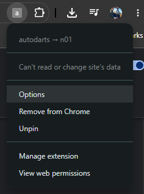
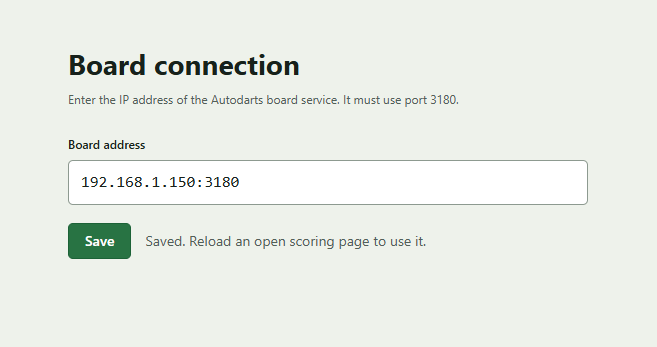

# autodarts → n01 (bridge)

**Version:** 0.0.1

Content script conversion of the original TamperMonkey userscript. This browser extension reads the AutoDarts board and enters turns into n01 or DartCounter automatically.

---

## Table of contents
- About
- Features
- Supported sites
- Installation (End user)
- Development (Load unpacked / test locally)
- File layout
- Permissions
- Configuration
- Privacy
- Usage
- Troubleshooting
- Contributing
- License

## About

This project is a Manifest V3 browser extension that reads the AutoDarts board and enters turns into n01, nakka, or DartCounter. It injects its content scripts only on supported scoring pages and started as a conversion of a TamperMonkey userscript.

## Features

- Automatically reads turns from the AutoDarts board
- Enters turns into n01 or DartCounter web UI
- Displays board state, darts, turn totals, and scoring controls in a right-hand sidebar
- Supports preview mode, automatic turn entry, or confirmation before entry
- Stores extension configuration locally in Chrome

## Installation Instructions

1. Get the latest [Release](https://github.com/jer-tav/AutoDartsN01/archive/refs/tags/v0.1.0.zip)
2. Extract it to a folder
3. Go to [chrome://extensions](chrome://extensions) and make sure Developer Mode is enabled in the top right
4. Choose "Load Unpacked" from the top bar, and browse to the folder where the release was unzipped.
5. From the extension icon at the top of the browser, choose "Options" 

   
6. Enter in the IP address of your Autodarts setup (i.e. 192.168.1.100:3180 or 127.0.0.1:3180)

   

## Usage

The extension panel appears as a right-hand sidebar on supported n01, nakka, and DartCounter pages. The page uses the remaining two-thirds of the browser while the sidebar is open; use the `-` button in the panel header to minimize it and restore the page to full width.

1. Reload the target game page after installing or reloading the extension.
2. In the sidebar, enter the AutoDarts board address in the address field. Use a full URL such as `http://192.168.1.50:3180`, then press `Enter` to save it. Chrome asks for access to that exact board address; approve the request to use the board. The extension attempts to find a local board automatically at `http://127.0.0.1:3180` when no address has been saved.
3. Leave the panel in **PREVIEW** mode while confirming that board events and detected darts are correct. Preview mode never enters scores into the game.
4. Press **START** only when ready to enter scores automatically. Press **STOP** or `Ctrl+Shift+X` to return immediately to preview mode.
5. Open the settings button to configure:
  - When turns are entered: automatically when darts are removed, or only after confirmation.
  - Panel size and opacity.
  - Keyboard shortcuts for confirming a turn and correcting each dart.
6. In confirmation mode, use the configured confirm shortcut (default: `Enter`) to send the shown turn. The default dart-correction shortcuts are `F1`, `F2`, and `F3`.

The extension stores its board address, language, entry mode, panel state, appearance settings, position preferences, and shortcuts in Chrome storage. See [PRIVACY.md](PRIVACY.md) for the complete data-handling description.

## Supported sites

The extension injects scripts on the following host patterns (from the manifest):

- `https://n01darts.com/n01/web/*`
- `https://n01darts.com/n01/online/n01.php*`
- `https://n01darts.com/n01/tournament/n01_live.php*`
- `https://n01darts.com/n01/tournament/n01_online.php*`
- `https://n01darts.com/n01/league/n01_live.php*`
- `https://n01darts.com/n01/league/n01_online.php*`
- `https://nakka.com/n01/web/*`
- `https://nakka.com/n01/online/n01.php*`
- `https://nakka.com/n01/tournament/n01_live.php*`
- `https://nakka.com/n01/tournament/n01_online.php*`
- `https://nakka.com/n01/league/n01_live.php*`
- `https://nakka.com/n01/league/n01_online.php*`
- `https://app.dartcounter.net/*`

## File layout

Key files in the repository:

- [manifest.json](manifest.json) — extension manifest
- [background.js](background.js) — service worker that requests board permission and reads the board API
- [bootstrap_storage_sync.js](bootstrap_storage_sync.js) — storage bootstrap helper used by content scripts
- [contentScript-full.js](contentScript-full.js) — main content script that renders the sidebar, reads board state, and enters scores

## Permissions

From the manifest:

- `storage` — persists extension configuration and its storage mirror locally in Chrome.
- Required host permissions cover n01, nakka, DartCounter, and the default local board addresses `http://127.0.0.1:3180` and `http://opendartboard.local:3180`.
- Optional host permissions cover custom HTTP or HTTPS board addresses. Chrome prompts for permission to the exact board origin when you save one.

## Privacy

The extension has no developer-operated server and does not sell, share, or transmit data to the developer. It communicates only with the supported scoring page and the board address you configure. See [PRIVACY.md](PRIVACY.md) for the policy suitable for the Chrome Web Store listing.

## Troubleshooting

- Extension doesn't run on a supported page:
  - Confirm page URL matches one of the host patterns in Supported sites.
  - Open DevTools console to check for errors.
  - Ensure extension is enabled and reloaded (in `chrome://extensions`).
- Symptoms of missing functionality:
  - Confirm scripts are present in the extension folder and the manifest references them (see File layout).
  - Check for CSP issues or site changes — sites occasionally change layout or JS APIs which can break automated input flows.
- For development debugging:
  - Use `console.log` and breakpoints in the content script.
  - Inspect the background service worker via `chrome://extensions` → Inspect views (service worker).

## Contributing

Contributions are welcome. Suggested workflow:

1. Fork the repo.
2. Make changes on a feature branch.
3. Test locally by loading the unpacked extension.
4. Open a pull request with a clear description of changes and testing steps.

If you change manifest host permissions, scripts, or behavior that affects privacy or host access, call that out clearly in the PR description.

## License

This repository does not include a license file by default. If you want to make this project open source, consider adding an OSI-approved license such as MIT. Add a `LICENSE` file to the repo and update this section.

## Acknowledgements

- This project converts functionality originally implemented as a TamperMonkey userscript.
- Thanks to the maintainers/users of AutoDarts, n01, and DartCounter for the web UIs used as targets.

## Contact

For questions, issues, or feature requests, open an issue in this repository.

---

_Review the privacy policy before each release if the extension's storage, host permissions, or network behavior changes._